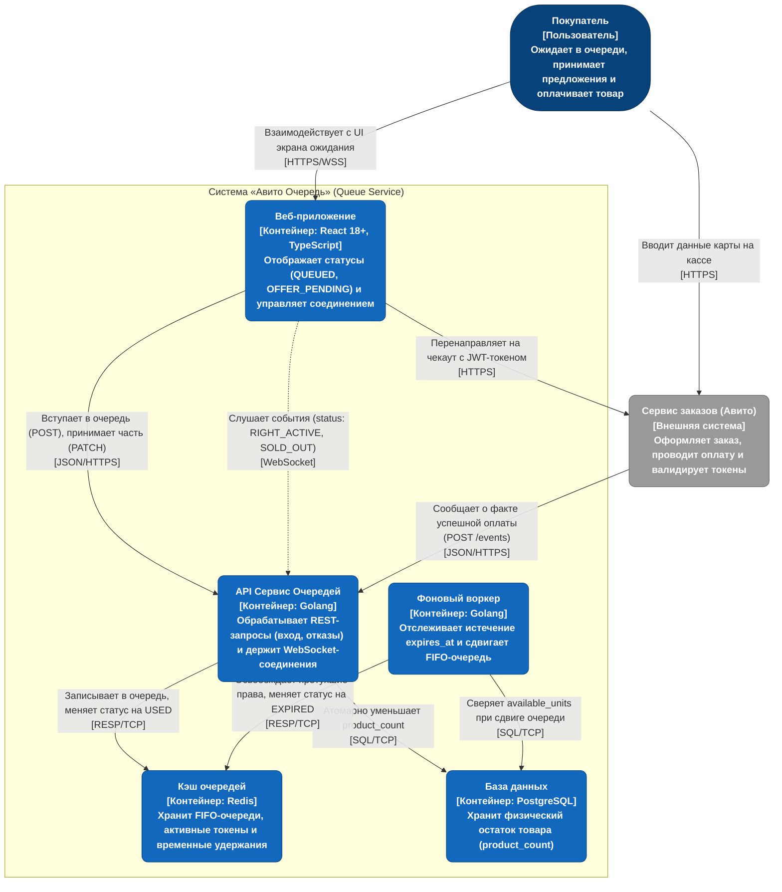

```mermaid
flowchart TD
classDef person fill:#08427b,stroke:#052e56,color:#ffffff,font-weight:bold,rx:50,ry:50
classDef container fill:#1168bd,stroke:#0b4884,color:#ffffff,font-weight:bold,rx:10,ry:10
classDef database fill:#1168bd,stroke:#0b4884,color:#ffffff,font-weight:bold,rx:10,ry:10,shape:cylinder
classDef external fill:#999999,stroke:#6b6b6b,color:#ffffff,font-weight:bold,rx:10,ry:10

User("Покупатель<br/>[Пользователь]<br/>Ожидает в очереди, принимает предложения и оплачивает товар"):::person
OrderService("Сервис заказов (Авито)<br/>[Внешняя система]<br/>Оформляет заказ, проводит оплату и валидирует токены"):::external

subgraph System ["Система «Авито Очередь» (Queue Service)"]
direction TB

WebApp("Веб-приложение<br/>[Контейнер: React 18+, TypeScript]<br/>Отображает статусы (QUEUED, OFFER_PENDING) и управляет соединением"):::container

QueueAPI("API Сервис Очередей<br/>[Контейнер: Golang]<br/>Обрабатывает REST-запросы (вход, отказы) и держит WebSocket-соединения"):::container
Worker("Фоновый воркер<br/>[Контейнер: Golang]<br/>Отслеживает истечение expires_at и сдвигает FIFO-очередь"):::container

Redis("Кэш очередей<br/>[Контейнер: Redis]<br/>Хранит FIFO-очереди, активные токены и временные удержания"):::database
Postgres("База данных<br/>[Контейнер: PostgreSQL]<br/>Хранит физический остаток товара (product_count)"):::database
end

User -- "Взаимодействует с UI экрана ожидания<br/>[HTTPS/WSS]" --> WebApp
User -- "Вводит данные карты на кассе<br/>[HTTPS]" --> OrderService

WebApp -- "Вступает в очередь (POST), принимает часть (PATCH)<br/>[JSON/HTTPS]" --> QueueAPI
WebApp -. "Слушает события (status: RIGHT_ACTIVE, SOLD_OUT)<br/>[WebSocket]" .-> QueueAPI

WebApp -- "Перенаправляет на чекаут с JWT-токеном<br/>[HTTPS]" --> OrderService

OrderService -- "Сообщает о факте успешной оплаты<br/>(POST /events)<br/>[JSON/HTTPS]" --> QueueAPI

QueueAPI -- "Атомарно уменьшает product_count<br/>[SQL/TCP]" --> Postgres
QueueAPI -- "Записывает в очередь, меняет статус на USED<br/>[RESP/TCP]" --> Redis

Worker -- "Освобождает протухшие права, меняет статус на EXPIRED<br/>[RESP/TCP]" --> Redis
Worker -- "Сверяет available_units при сдвиге очереди<br/>[SQL/TCP]" --> Postgres
```