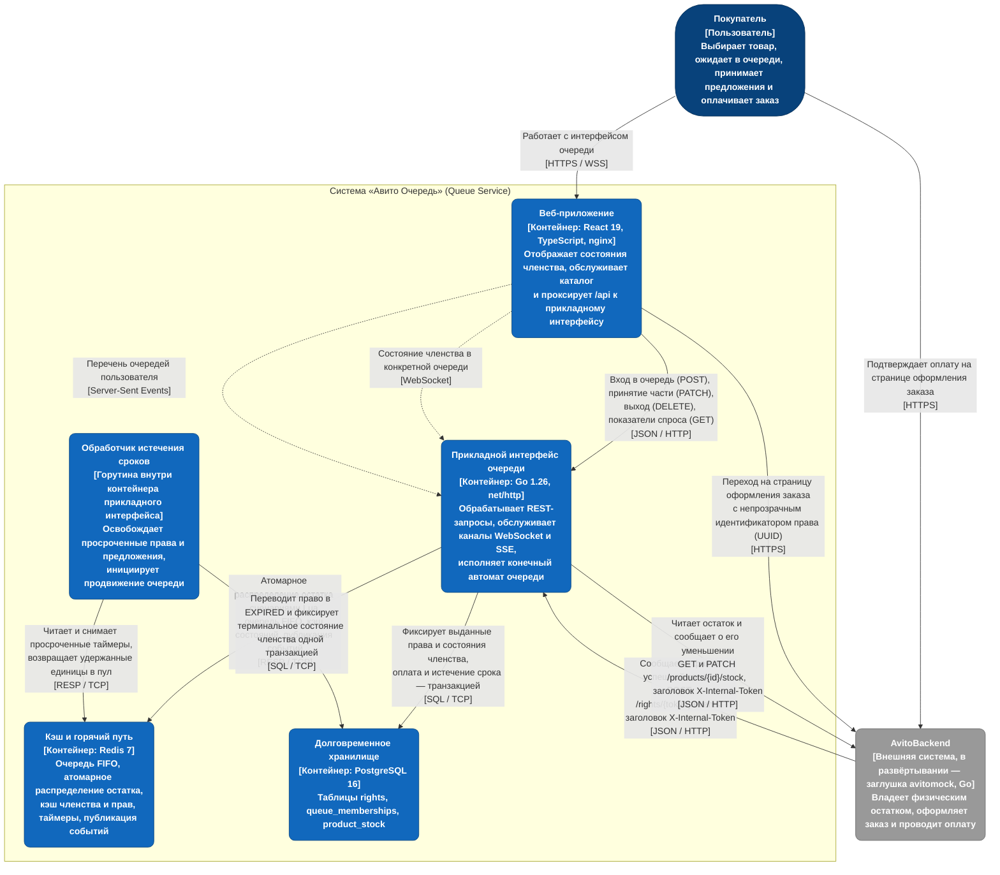

# Диаграмма контейнеров C4 (уровень 2)

Диаграмма описывает исполняемые единицы решения, их зоны ответственности и протоколы взаимодействия. Состав контейнеров соответствует файлу `docker-compose.yml`; внешняя система AvitoBackend в развёртывании замещена заглушкой `backend/cmd/avitomock`.

Обработчик истечения сроков не выделен в отдельный контейнер: он исполняется отдельной горутиной внутри процесса прикладного интерфейса и запускается в `backend/cmd/api/main.go`.

## Разграничение ответственности хранилищ

Redis и PostgreSQL решают различные задачи, взаимная замена которых невозможна.

Предотвращение состязания за последнюю единицу товара обеспечивается сценарием Lua в Redis: решение о выдаче принимается атомарно в рамках единственной операции. PostgreSQL в принятии решения не участвует.

Сохранность принятого решения обеспечивается PostgreSQL. Порядок операций записи фиксирован: сначала долговременное хранилище, затем кэш. Подробное изложение приведено в `docs/storage/redis.md` и `docs/storage/postgres.md`.

## Разграничение доступа

| Группа конечных точек | Инициатор вызова | Механизм контроля |
| --- | --- | --- |
| `/api/v1/queue/*`, `/api/v1/me/queues`, `GET /api/v1/rights/{token}` | Браузер покупателя | Заголовок `X-User-Id`; для каналов реального времени — параметр запроса `user_id` |
| `POST /api/v1/rights/{token}/events` | Внешняя система AvitoBackend | Заголовок `X-Internal-Token` |
| `GET /api/v1/queue/{product_id}/stats`, `/healthz` | Произвольный | Отсутствует |

Право на покупку представлено непрозрачным значением UUID и не содержит кодированных данных: принадлежность устанавливается поиском записи и сравнением её поля `user_id` с идентификатором обратившегося (`docs/design_context.md`, п. 4).
