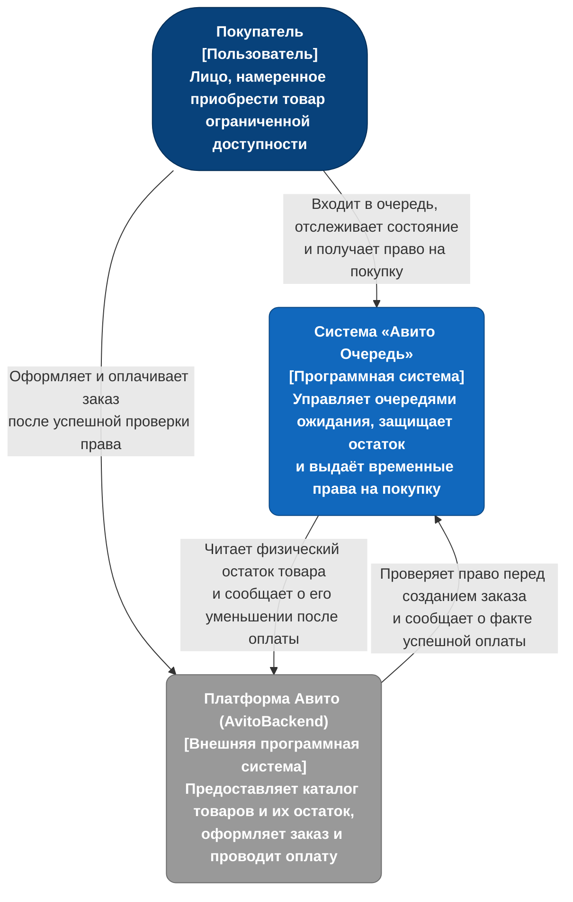

# Диаграмма контекста C4 (уровень 1)

Диаграмма описывает взаимодействие пользователя с системой «Авито Очередь» и её встраивание в экосистему основной платформы. Декомпозиция системы на исполняемые единицы приведена в `docs/c4_container.md`.

Платформа Авито представлена в решении внешней системой AvitoBackend, находящейся вне области кейса: она владеет каталогом, физическим остатком товара, оформлением заказа и оплатой. В развёртывании она замещена заглушкой `backend/cmd/avitomock`, что позволяет пройти пользовательский сценарий целиком.

Взаимодействие с внешней системой двунаправленно и ограничено четырьмя вызовами: чтение остатка и уведомление о его уменьшении — со стороны Queue Service; проверка права перед созданием заказа и сообщение о факте оплаты — со стороны платформы. Все четыре защищены разделяемым секретом в заголовке `X-Internal-Token`.

Проверка права перед созданием заказа образует границу доверия механики очереди: без неё покупатель мог бы обратиться к оформлению заказа напрямую, минуя очередь (`docs/design_context.md`, п. 5.8).

Каталог товаров Queue Service не дублирует: клиентское приложение самостоятельно сопоставляет `product_id` с карточкой товара.
