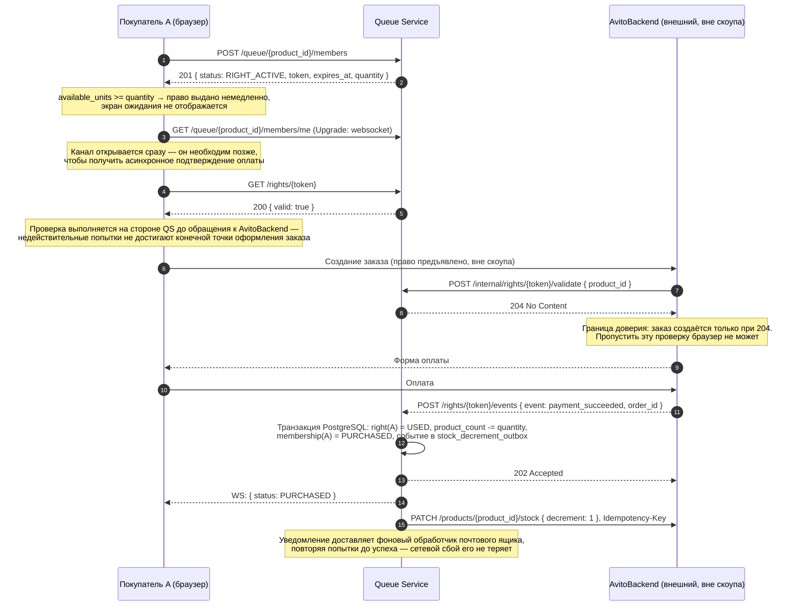
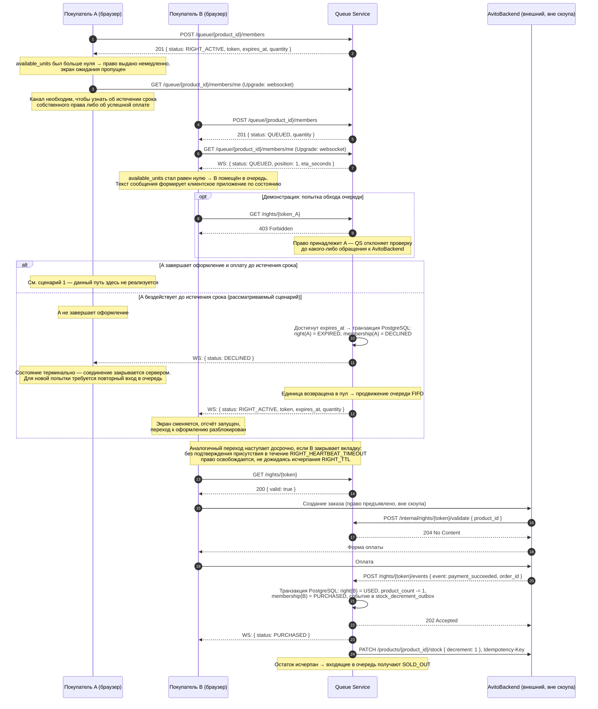
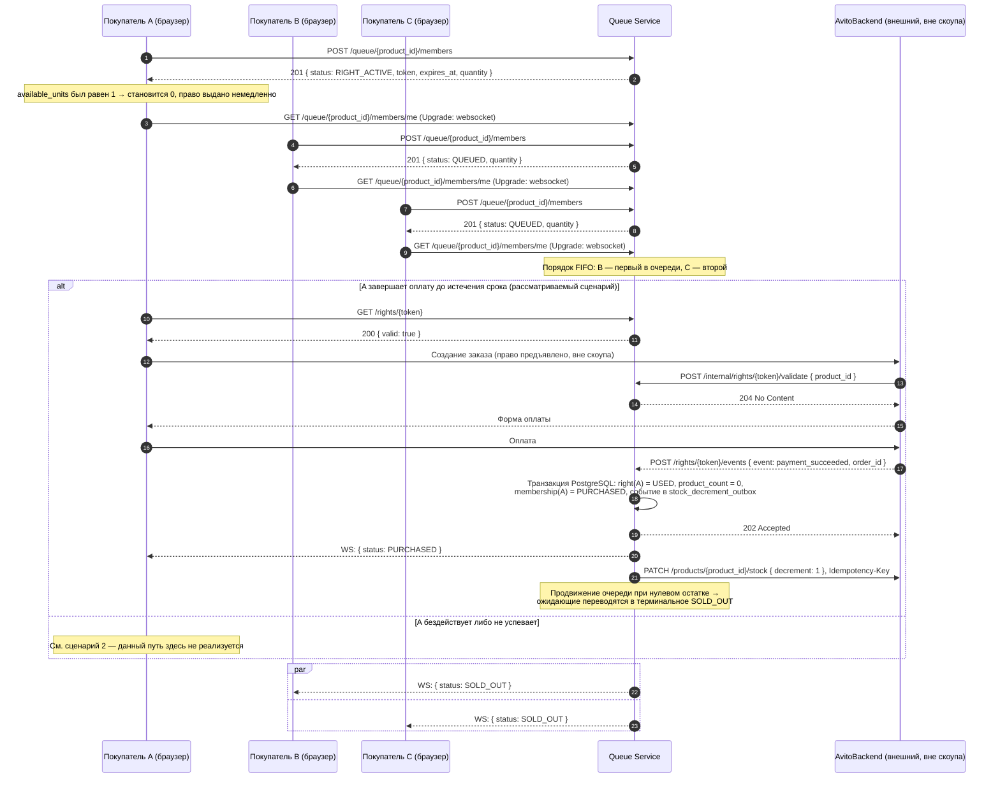
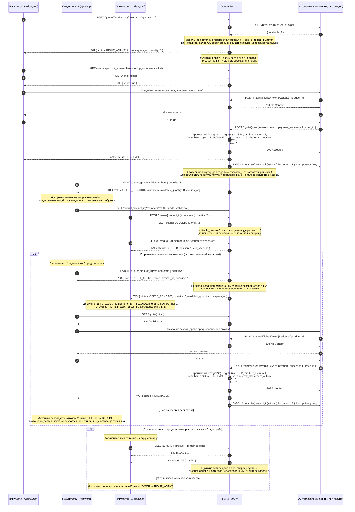

# Диаграммы последовательности: «Авито Очередь»

Четыре сценария покрывают все терминальные состояния основного пути: немедленная покупка, покупка после ожидания, отказ вследствие исчерпания остатка, многоштучный запрос с частичным предложением. Обоснование принятых решений приведено в `docs/design_context.md`, форма прикладного интерфейса — в `docs/api.yml`.

Обозначения участников едины для всех сценариев: `A`, `B`, `C` — покупатели (браузер), `QS` — Queue Service, `AB` — AvitoBackend, внешняя система Авито, находящаяся вне области кейса и инкапсулирующая оформление заказа, оплату, а также данные о товаре и его остатке.

В сценариях 1–3 каждый покупатель запрашивает одну единицу, вследствие чего поле `quantity` в запросах опущено для краткости. Сценарий 4 — единственный, в котором запрашиваемое количество превышает единицу и участвует в логике распределения.

Защита от обхода очереди изображена двумя шагами. Покупатель обращается к `GET /rights/{token}` перед переходом к оформлению заказа: проверка отсекает недействительные попытки — предъявление чужого либо истёкшего права — до того, как они достигнут внешней системы. Затем сама AvitoBackend обращается к `POST /internal/rights/{token}/validate` и создаёт заказ исключительно при получении кода `204`. Первый шаг является клиентским и может быть пропущен, второй представляет собой границу доверия и пропущен быть не может (`docs/design_context.md`, п. 5.8).

Вход в очередь при непустой очереди приводит к состоянию `QUEUED` независимо от наличия свободных единиц: освободившиеся единицы принадлежат голове очереди, а не вновь пришедшему. Условие проверяется тем же атомарным шагом, что и распределение остатка.

Уведомление AvitoBackend об уменьшении остатка (`PATCH /products/{product_id}/stock`) отправляется после ответа `202`, а не до него: событие фиксируется той же транзакцией, что и оплата, а доставляет его фоновый обработчик почтового ящика, повторяя попытки до успеха.

Обращение `GET /products/{product_id}/stock` к AvitoBackend выполняется при обработке входа в очередь, не завершившегося идемпотентным возвратом существующего членства; полученное значение применяется исключительно при отсутствии локального состояния товара (`docs/design_context.md`, п. 9). Для краткости шаг показан только в сценарии 4, где значение остатка существенно для понимания последующих переходов.

Мгновенные состояния сопровождаются уведомлением по каналу реального времени. Публикуемое в Redis сообщение является сигналом инвалидации: обработчик повторно читает текущее состояние и передаёт клиенту фактическое представление. На диаграммах показан результат, то есть состояние, полученное клиентом.

Блоки `alt`, `opt` и `par` применяются в точках действительного ветвления — принятие решения пользователем, состязание «успел либо не успел», — а не для перечисления всех теоретически возможных исходов одного вызова.

---

## Сценарий 1 — единственный покупатель, очередь не образуется

---

## Сценарий 2 — состязание, право переходит второму покупателю

Товар с единственной свободной единицей. Покупатель A получает право первым, но бездействует до истечения срока; право переходит покупателю B в порядке FIFO, и B завершает оплату.

---

## Сценарий 3 — состязание, опоздавшие получают SOLD_OUT

Тот же товар с единственной свободной единицей. Покупатель A получает право первым и завершает оплату до истечения срока. Покупатели B и C помещены в очередь следом и права не получат, поскольку единица продана.

---

## Сценарий 4 — несколько единиц товара, частичное предложение и отказ

Товар с остатком в четыре единицы. Покупатель A приобретает одну единицу и полностью завершает покупку до входа покупателя B, вследствие чего к моменту входа B доступно три единицы. Покупатель B запрашивает пять, получает частичное предложение на три и принимает две. Покупатель C запрашивает две и помещается в очередь, поскольку на момент его входа всё доступное количество удержано за B; возвращённая при частичном принятии единица немедленно направляется C в виде нового предложения, от которого C отказывается. Одна единица остаётся нераспроданной, что является допустимым исходом.

