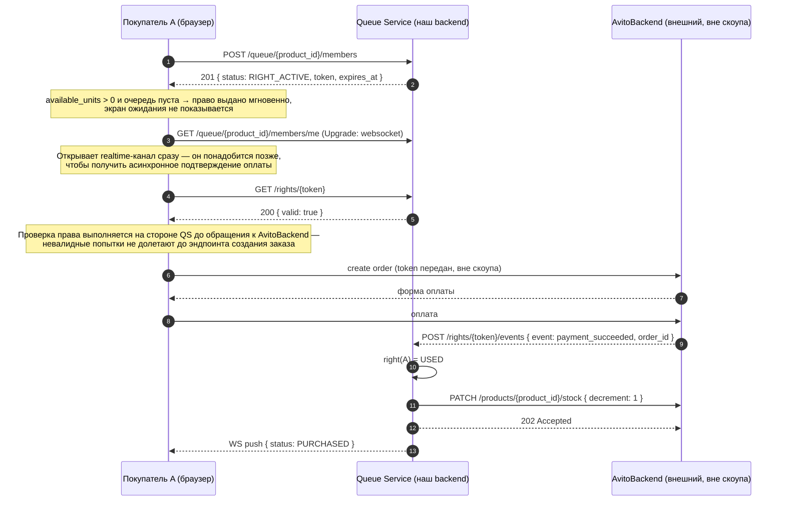
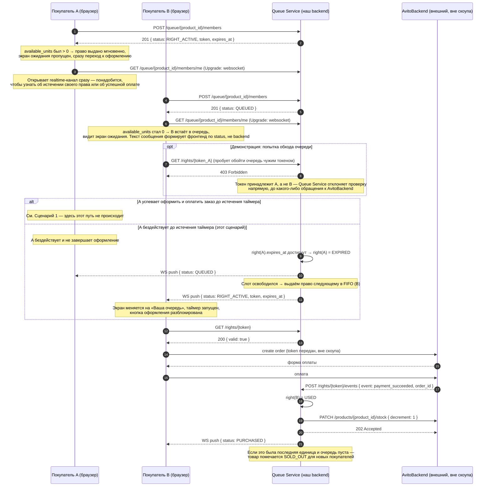
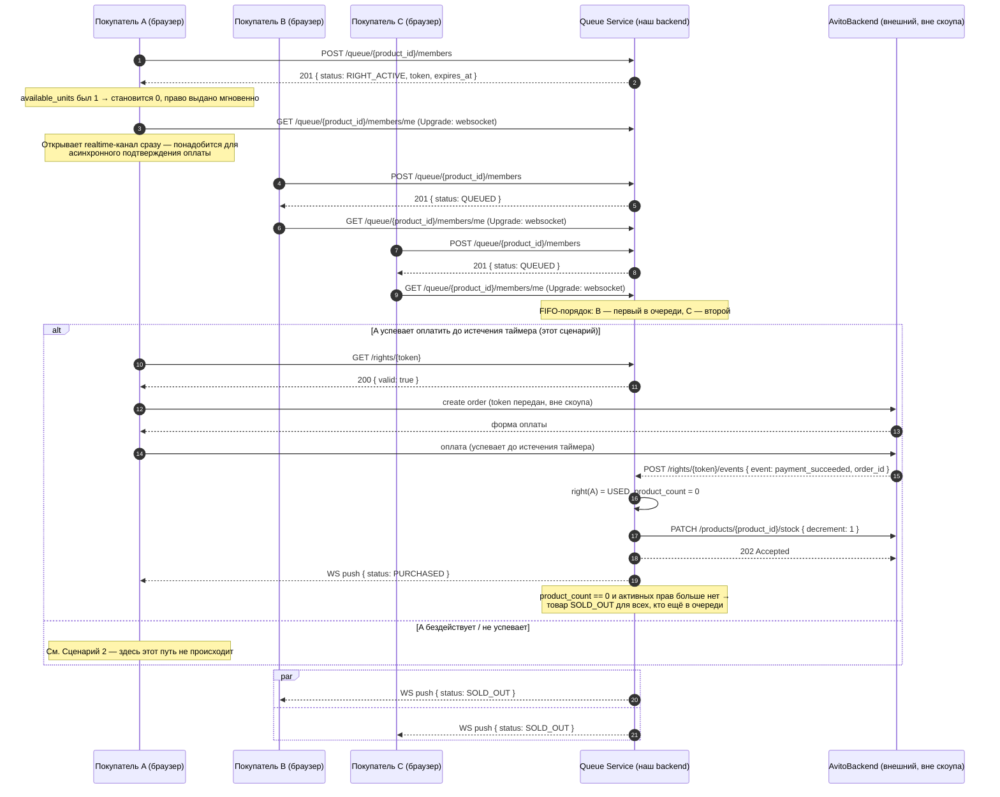
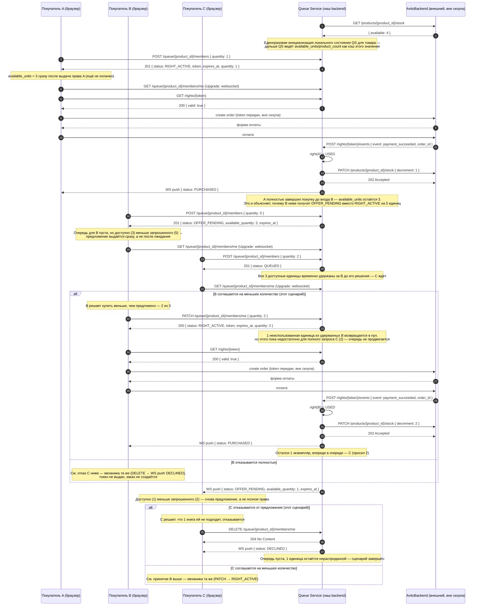

# Диаграммы последовательности: Авито Очередь

Четыре сценария покрывают все финальные состояния основного пути (мгновенная покупка / успех после ожидания / отказ из-за распроданности / многоштучный запрос с частичным предложением). Подробное описание каждого пронумерованного перехода — в `docs/user_story.md` (для сценариев 1–3; сценарий 4 пока не задокументирован там отдельно).

В сценариях 1–3 каждый покупатель запрашивает `quantity: 1`, поэтому это поле в запросах и в `product_count` опущено для краткости и показано как `product_count--`. Сценарий 4 — единственный, где `quantity` больше 1 и явно участвует в логике.

Условное обозначение участников везде одинаковое: `A`, `B`, `C` — покупатели (браузер), `QS` — Queue Service (наш backend), `AB` — AvitoBackend (внешний бэкенд Авито, вне скоупа кейса; инкапсулирует все условно существующие API текущего бэкенда Авито — оформление заказа/оплату, а также данные о товаре и его остатке).

Перед созданием заказа в AvitoBackend покупатель напрямую вызывает `GET /rights/{token}` у Queue Service, чтобы проверить своё право — это отсекает невалидные попытки (чужой/просроченный токен) до того, как они дойдут до эндпоинта создания заказа AvitoBackend. Этот шаг показан во всех сценариях перед `create order`.

---

## Сценарий 1 — покупатель один, очереди нет

---

## Сценарий 2 — гонка, второй покупатель получает право и покупает

Товар с одним свободным слотом (`total_stock = 1`) в момент конфликта. A первым получает право, но бездействует до истечения таймера; право переходит к B по FIFO, и B успевает оплатить.

---

## Сценарий 3 — гонка, опоздавшие получают SOLD_OUT

Тот же товар с `total_stock = 1`. A получает право первым и сразу оплачивает — быстрее, чем истекает таймер. B и C встают в очередь следом за A и никогда не получат право, потому что единица уже продана.

---

## Сценарий 4 — несколько единиц товара, частичное предложение и отказ

Товар с `total_stock = 4`. A берёт 1 штуку сразу и полностью завершает покупку (create order → оплата → `payment_succeeded`) до того, как B входит в очередь — именно поэтому к моменту входа B доступно уже 3, а не 4. B хочет 5, но доступно только 3 — получает предложение (`OFFER_PENDING`) сразу при входе (очередь для него пуста) и соглашается на 2. C хочет 2, встаёт в очередь, т.к. на момент его входа всё оставшееся удержано за B; когда B оплачивает, остаётся только 1 единица — C получает предложение уже на неё и отказывается, оставляя эту единицу непроданной.

